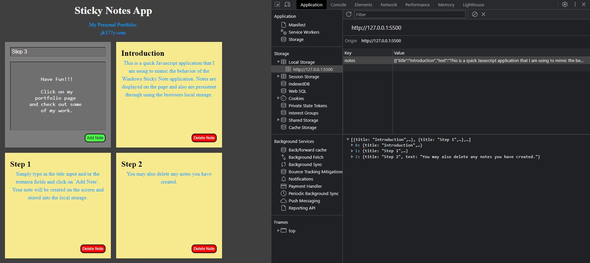

# Sticky Notes App
 

## Live Application
https://sticky-notes-iota.vercel.app/

## Description
This is a quick Javascript application that I am using to mimic the behavior of the Windows Sticky Note application. Notes are displayed on the page and also are persistent through using the browser's local storage. 

## Screenshot
 

## *Questions*
<h3>Portfolio:&emsp;<a href="https://jk377y.com" target="_blank">https://jk377y.com</a></h3>
<h3>Email:&emsp;<a href="mailto:jk377y@gmail.com" target="_blank">jk377y@gmail.com</a></h3>
<h3>LinkedIn:&emsp;<a href="https://www.linkedin.com/in/james-kelly-software-developer/" target="_blank">https://www.linkedin.com/in/james-kelly-software-developer/</a></h3>
<h3>GitHub:&emsp;<a href="https://github.com/jk377y" target="_blank">https://github.com/jk377y</a></h3>
 

## *License*

 Copyright (c) 2023 James Kelly
 Information on this license can be found at: (https://opensource.org/licenses/MIT)
